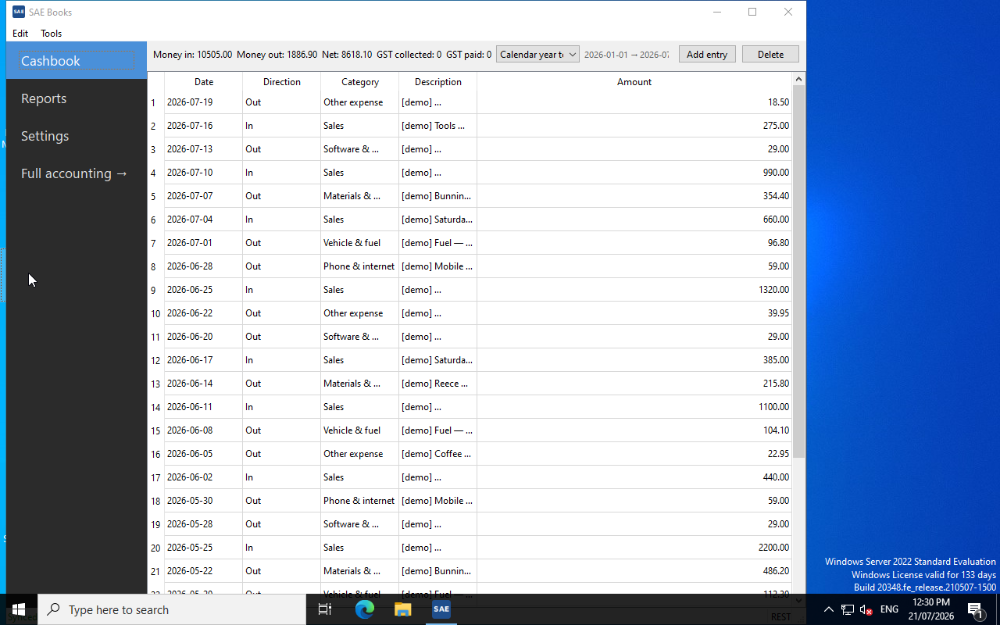
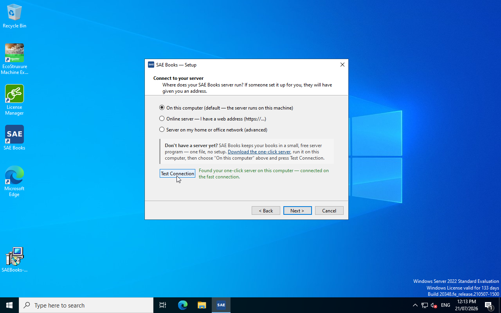

# saebooks-desktop

Native desktop client for [SAE Books](https://github.com/saebooks/saebooks)
— free, self-hosted double-entry accounting. PySide6/Qt thin client that
talks to a SAE Books server (gRPC fast path + REST). Ships in two brands
from one codebase: **SAE Books** and **tasur** (the Estonian edition,
[tasur.ee](https://tasur.ee)).

> **Status: v0.4 — public BETA.** Installs and runs on a clean machine with
> no dev tools (the v0.3.0 Windows dead-on-arrival bug is fixed — the VC++
> runtime is now bundled). Binaries are **unsigned**: Windows SmartScreen
> will warn on first run; verify downloads against the release
> `SHA256SUMS`. AGPL-3.0.



## Install

Download from the
[v0.4 release](https://github.com/saebooks/saebooks-desktop/releases/tag/v0.4):

| Platform | SAE Books | tasur |
|---|---|---|
| Windows 10/11 x64 | `SAEBooks-0.4.0-x64.msi` | `tasur-0.4.0-x64.msi` |
| Linux x86_64 | `SAEBooks-0.4.0-x86_64.AppImage` | `tasur-0.4.0-x86_64.AppImage` |
| macOS | *v0.4 build pending* — use the universal DMG on the [v0.3.0 release](https://github.com/saebooks/saebooks-desktop/releases/tag/v0.3.0) | — |

**Windows:** double-click the MSI. SmartScreen shows "Windows protected your
PC" — click **More info → Run anyway** (unsigned build; expected). The VC++
runtime is bundled — nothing else to install. You get a Start-menu entry and
desktop shortcut.

**Linux:** make the AppImage executable (right-click → Properties →
"Allow executing file as program", or `chmod +x`) and double-click it. If
nothing happens, install FUSE 2 (`sudo apt install libfuse2`) and try again.

Verify any download: `sha256sum -c SHA256SUMS` against the file published on
the release page. A plain-language walk-through for non-technical users is
in [INSTALL.md](./INSTALL.md).

## First run — auto-pairing

The desktop app is the window onto your books; the books live on a SAE Books
server. On first launch a short wizard asks where that server is:

- **On this computer** (default) — the wizard probes for a locally running
  [one-click server](https://github.com/saebooks/saebooks/releases)
  (ports `18961` REST / `18962` gRPC) and the Docker community bundle, and
  pairs with whichever it finds. Press **Test Connection** and it reports
  "Found your one-click server on this computer".
- **Online server** — enter the web address you were given
  (e.g. `https://books.example.com`).
- **Server on my home or office network** — advanced; enter host/ports
  yourself.

No server yet? The wizard links to the one-click server download — one
file, no setup. Then sign in with your books account and pick your company.
Settings persist via `platformdirs` in your OS user-config directory.



## What's in v0.4

- **One-click server auto-pairing** in the first-run wizard, plus a
  no-server escape hatch.
- **Bank statement import + reconciliation views.**
- **Period picker** on the dashboard and cashbook (replaces the hardcoded
  trailing-12-months view).
- **Branded install UX** — application icon on every surface, Start-menu +
  desktop shortcuts, real Selge brand assets for tasur.
- **Smaller**: MSI 252 MB → 47.5 MB; AppImage 248 MB → 95 MB (PySide6
  trimmed to Essentials).

tasur note: the Estonian and Russian UI is currently machine-translated,
pending human review.

## Running from source

```bash
git clone https://github.com/saebooks/saebooks-desktop.git
cd saebooks-desktop
uv sync
uv run saebooks-desktop        # or the tasur brand: uv run python -m tasur
```

Requires Python 3.10+. Dependency note: the client depends on
**`PySide6-Essentials`**, not the full `PySide6` meta-package — everything
the app imports (QtWidgets/QtGui/QtCore/QtSvg) lives in Essentials, and the
full package would drag in PySide6-Addons (WebEngine, Quick3D, Charts,
Multimedia, …) for roughly 500 MB of dead weight in frozen builds. If you
add a dependency or build tooling, keep it Essentials-only (see the comments
in `pyproject.toml` and `deploy/appimage/requirements.txt`).

## Project layout

```
saebooks_desktop/
  main.py            entry point
  main_window.py     top-level Qt window
  settings.py        persisted config
  branding.py        brand resolution (env > baked > settings > default)
  licence.py         licence-key validation
  views/             per-domain Qt views
  wizard/            first-run wizard (server connect, sign-in, company)
  services/          API + gRPC clients
  grpc_gen/          generated protobuf stubs
tasur/               tasur brand entry point
proto/               .proto sources
deploy/
  windows/           cx_Freeze setup (MSI)
  appimage/          python-appimage build inputs
  macos/             DMG build inputs
scripts/
  build_msi.bat      Windows MSI build (run on Windows)
  build_appimage.sh  Linux AppImage build
```

## Building installers

```bash
# Linux AppImage (per brand)
./scripts/build_appimage.sh --brand saebooks
./scripts/build_appimage.sh --brand tasur

# Windows MSI (run on a Windows 10/11 x64 host, Python 3.12 + cx_Freeze >= 7.2)
scripts\build_msi.bat            # SAE Books brand
scripts\build_msi.bat tasur      # tasur brand
```

Outputs land in `dist/`. Each brand bakes its identity into the artifact
(env `SAEBOOKS_BRAND` in the AppImage entrypoint; `brand.cfg` + its own MSI
upgrade code on Windows).

## Licence

AGPL-3.0. See <https://github.com/saebooks/saebooks> for the
top-level project, charter, and commercial licensing options.
